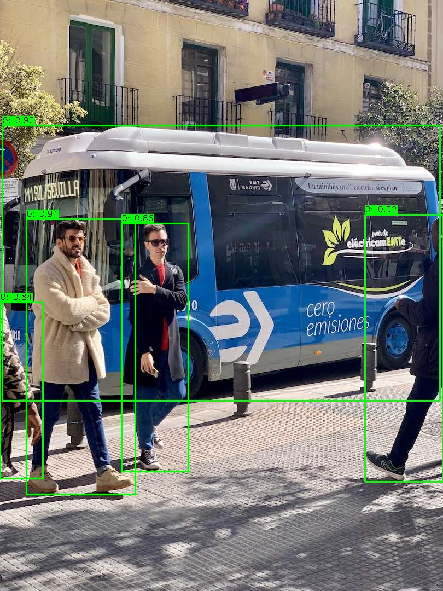
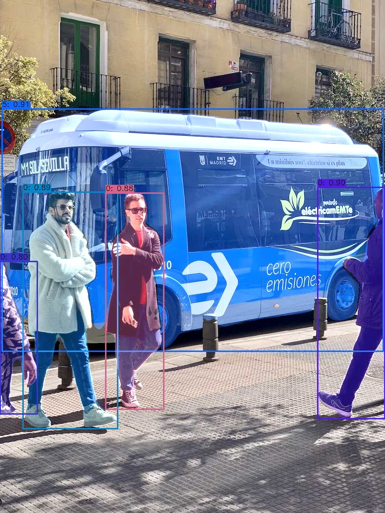
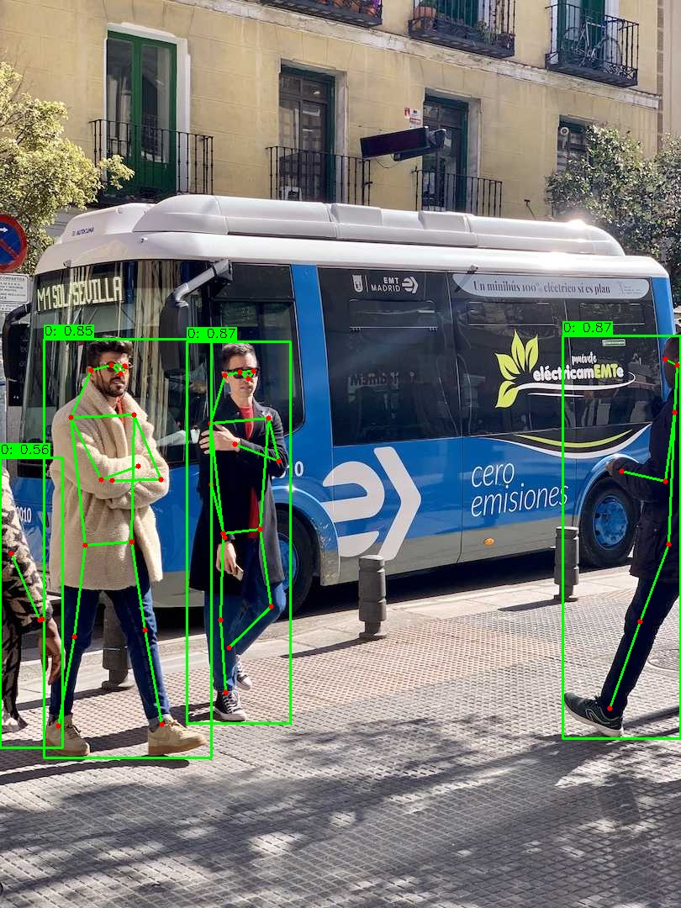

# yolo-onnx

[English](README.md) | 简体中文

基于 ONNX Runtime 的 C++17 YOLO 推理框架。一条 `.onnx` 走到底，硬件加速通过 Execution Provider 切换，编译期零 EP 依赖。

[]()
[]()
[]()
[]()

<div align="center">
  
  
  
  
  <p><em>YOLO26 检测 · 分割 · 姿态估计 · 语义分割 —— 均为本框架在 bus.jpg 上的实际推演输出</em></p>
</div>

## ✨ 特性

- 🧩 **模型覆盖广**：YOLOv5 / YOLOX / YOLOv8 / YOLOv11 / YOLO26 / PPYOLOE，每种格式一个 `Decoder` 子类，互不干扰
- 🚀 **多任务统一接口**：检测 / 分割 / 姿态 / 旋转框 / 语义分割共用一条管线，返回 `std::variant`，无 `dynamic_cast`
- ⚡ **EP 即插即用**：CUDA / TensorRT / OpenVINO / ROCm / MIGraphX / VitisAI / QNN / CoreML / XNNPACK… 换 EP 只改一个参数，**不需要重新编译**（EP 动态库由 onnxruntime 运行时加载）
- 🧪 **可验证的准确性**：`tools/` 提供与 ultralytics / onnxruntime 参考实现逐框比对的工具链，精度问题用数字说话而不是肉眼看图
- 🪶 **零隐藏依赖**：对外仅两个头文件（`yolo_onnx.hpp` + `yolo_onnx_types.hpp`），后端/前后处理全在 `src/` 内部
- 🔌 **可独立复用**：`postprocess_core.hpp` 的 NMS / IoU / 坐标还原是 header-only 自由函数，可直接拷进其他项目

## 📊 性能实测

在 **RTX 4070 Ti SUPER** + **i5-10400F(12 线程)** 上实测，`yolo11n` 640×640、batch=1、100 次取平均，统计的是 **端到端 `Model::infer()`**（含 letterbox 预处理、NMS、可视化前的全部流程）：

| 后端 | 端到端延迟 | 吞吐 | 相对 CPU |
|------|-----------|------|---------|
| ONNX Runtime CPU | 47.6 ms | 21 fps | 1.0× |
| OpenVINO CPU | 32.1 ms | 31 fps | 1.5× |
| OpenVINO GPU (Intel 核显) | 14.3 ms | 70 fps | 3.3× |
| **ONNX Runtime CUDA EP** | **8.1 ms** | **123 fps** | **5.8×** |
| **ONNX Runtime TensorRT EP (FP16)** | **7.1 ms** | **141 fps** | **6.7×** |

> TensorRT EP 首次加载会构建 engine（约 1 分钟），已默认开启 engine 缓存（`/tmp`），后续加载秒开。
> 上表由 `Model::infer()` 端到端测得（预处理 + 推理 + 解码 + NMS 全流程），固定 1920×1080 输入、batch=1、100 次取平均。

## 📑 目录

- [yolo-onnx](#yolo-onnx)
  - [✨ 特性](#-特性)
  - [📊 性能实测](#-性能实测)
  - [🚀 快速开始](#-快速开始)
  - [🧩 C++ 用法](#-c-用法)
  - [🧠 架构](#-架构)
  - [🔌 后端与 Execution Provider](#-后端与-execution-provider)
  - [🧪 准确性验证工具](#-准确性验证工具)
  - [🧱 扩展](#-扩展)
  - [📁 项目结构](#-项目结构)
  - [📚 详细文档](#-详细文档)

## 🚀 快速开始

### 依赖

- C++17 编译器
- OpenCV >= 4.x
- ONNX Runtime >= 1.12（CPU 版即可跑通全部功能；GPU 加速需官方 `onnxruntime-gpu` 包）

### 构建

```bash
git clone <this-repo> && cd yolo-onnx

# 指定 ONNX Runtime 位置（也可用环境变量 ONNXRUNTIME_DIR）
export ONNXRUNTIME_DIR=/path/to/onnxruntime-linux-x64-1.23.2

mkdir build && cd build
cmake .. -DWITH_EXAMPLES=ON -DWITH_TESTS=ON
make -j$(nproc)

./tests/test_yolo        # 84 个单元测试
```

CMake 选项（默认全关）：

| 选项 | 说明 |
|------|------|
| `WITH_EXAMPLES` | 构建 `examples/`（默认 **ON**） |
| `WITH_TESTS` | 构建 `tests/test_yolo` |
| `WITH_TOOLS` | 构建 `tools/dump_json`（精度比对用） |
| `WITH_PYTHON` | 构建 pybind11 绑定（`python/`） |

### 命令行推理

```bash
# 检测（默认 CPU）
./examples/detect_image v11 ../assets/models/yolo11n.onnx ../assets/images/bus.jpg out.jpg

# 换 Execution Provider —— 同一个二进制，无需重编译
./examples/detect_image v11 model.onnx bus.jpg out.jpg --ep=cuda
./examples/detect_image v11 model.onnx bus.jpg out.jpg --ep=tensorrt --fp16

# 分割
./examples/segment_image v11 ../assets/models/yolo11s-seg640.onnx bus.jpg out.jpg --ep=cuda

# 姿态估计
./examples/pose_image v26 ../assets/models/yolo26s-pose.onnx ../assets/images/bus.jpg out.jpg --ep=cuda

# 语义分割（输出类别 id 图，按 ultralytics 调色板着色，可加图例）
./examples/sem_image v26 ../assets/models/yolo26s-sem.onnx ../assets/images/bus.jpg out.jpg --classes=19 --legend

# 调整阈值 / 输入尺寸 / 类别数
./examples/detect_image v5 model.onnx in.jpg out.jpg --score=0.25 --nms=0.45 --size=640 --classes=80
```

`model_type` 取值：`v5` / `yolox` / `v8` / `v11` / `v26` / `ppyoloe`。

输出：

```
Detected 5 objects:
  label=5 score=0.876215 rect=[4,260,805,751]
  label=0 score=0.875915 rect=[52,436,243,935]
  ...
```

## 🧩 C++ 用法

### 检测

```cpp
#include "yolo_onnx/yolo_onnx.hpp"
#include <opencv2/opencv.hpp>

auto model = yolo_onnx::create_model(yolo_onnx::ModelType::YOLOv11);

yolo_onnx::Model::Config config;
config.model_path    = "yolo11n.onnx";
config.score_thresh  = 0.5f;
config.nms_thresh    = 0.45f;
config.custom_config = "ep=cuda";        // 换 EP 只改这一行
model->load(config);

cv::Mat image = cv::imread("bus.jpg");
yolo_onnx::DetectResult det = model->infer_detect(image);

for (const auto& box : det.boxes) {
    printf("label=%d score=%.3f [%.0f,%.0f,%.0f,%.0f]\n",
           box.label, box.score, box.x1, box.y1, box.x2, box.y2);
}
```

### 多任务：分割 / 姿态 / 旋转框 / 语义分割

五个任务共用一个 `Model`，结果用 `std::variant` 返回，`std::get_if` 安全提取：

```cpp
auto model = yolo_onnx::create_model(yolo_onnx::ModelType::YOLOv11,
                                     yolo_onnx::TaskType::Segment);
model->load(config);

yolo_onnx::InferResult result = model->infer(image);

if (auto* seg = std::get_if<yolo_onnx::SegmentResult>(&result)) {
    // seg->boxes[i] — 检测框
    // seg->masks[i] — 分割掩码（已还原到原图尺寸）
} else if (auto* pose = std::get_if<yolo_onnx::PoseResult>(&result)) {
    // pose->boxes[i].keypoints
} else if (auto* obb = std::get_if<yolo_onnx::OBBResult>(&result)) {
    // obb->obb_boxes[i] — 旋转框 (cx, cy, w, h, angle)
} else if (auto* sem = std::get_if<yolo_onnx::SemResult>(&result)) {
    // sem->mask — 原图尺寸的类别 id 图（每像素一个类别 id，非概率）
}
```

也可用类型化入口：`infer_detect()` / `infer_segment()` / `infer_pose()` / `infer_obb()` / `infer_sem()`。

## 🧠 架构

管线是一条直线，每个环节都 behind 一个抽象接口，**新增模型格式或新任务都不需要改主干**：

```
image → PreProcess → Backend(forward) → TensorSet → Decoder → PostProcess → InferResult
        预处理         推理引擎         统一张量      解码       任务后处理      结果
```

```
yolo_onnx
├── Backend (src/core/)              ← 推理引擎，EP 切换在这里
│   └── OnnxruntimeBackend           ← 主线：CPU / CUDA / TensorRT / OpenVINO / ...
│       └── (可选) OpenvinoBackend   ← 独立运行时，默认不编译
├── PreProcess (src/process/preprocess/)
│   └── PreProcessParams::for_model()  ← 每种模型的差异化预处理都在这里
├── Decoder (src/process/postprocess/decoder/)
│   └── V5Decoder / YOLOXDecoder / V8Decoder / PPYOLOEDecoder
├── PostProcess (src/process/postprocess/)
│   ├── postprocess_core.hpp          ← 零依赖自由函数（nms / iou / restore_* / detect_pipeline）
│   └── Detect / Segment / Pose / OBB ← 只做任务分派，逻辑复用 core
└── Model (src/model.cpp)            ← 单一 Model 类 + PIMPL，无任何子类
```

三个正交的设计轴：

| 想加什么 | 改哪里 | 要不要动别的 |
|---------|-------|------------|
| 新的导出格式 | 加一个 `Decoder` 子类 + 工厂注册一行 | 不用 |
| 新的任务 | 加一个 `PostProcess` 子类 + 注册 + 结果类型 | 不用 |
| 新的 EP | 在 `setup_execution_providers()` 加一个 case | 不用 |

## 🔌 后端与 Execution Provider

**主线是 ONNX Runtime**：所有硬件加速都通过 EP 实现，编译期不链接任何 EP 库。换 EP 只改一个参数（`--ep=cuda`、`--ep=tensorrt --fp16`、`--ep=openvino` …），同一个二进制**不用重新编译**；EP 不可用时打印原因并**自动回退 CPU**，不会让推理失败。

> 完整 EP 列表（专用 API vs 通用白名单）、配置项、独立运行时后端（OpenVINO / CANN / RKNN）以及踩过的坑 —— 见 **[docs/backends.md](docs/backends.md)**

## 🧪 准确性验证工具

`tools/` 提供数字化的精度校验链路：**dump JSON → 跑参考实现 → 逐框 IoU 比对**——精度问题用数字定位，而不是盯着标注图猜（历史上多个解码 bug 在图上完全不可见，在 IoU 数字上极其明显）。

> 三步上手示例、各脚本用法、掩码校验（`check_masks_ul.py`）、预处理扫描、历史 bug 复盘 —— 见 **[docs/accuracy.md](docs/accuracy.md)**

## 🧱 扩展

三条**正交**的扩展轴，各自独立：

| 想加什么 | 要改的地方 | 不用改的 |
|---------|-----------|---------|
| 新的**导出格式** | 加一个 `Decoder` 子类 + 工厂注册 | `Model` / `PostProcess` / CMake |
| 新的**任务** | 加一个 `PostProcess` 子类 + 结果类型 | `Model` / `Decoder` |
| 新的**EP** | 一个 case（不用建类） | 整条推理管线 |
| 差异化的**预处理** | `PreProcessParams::for_model()` | 解码 / 后处理 |

> 完整步骤、接口签名、Decoder 契约与注意事项 —— 见 **[docs/extending.md](docs/extending.md)**

## 📁 项目结构

```
yolo-onnx/
├── include/yolo_onnx/            # 对外 API（仅此两个头文件）
│   ├── yolo_onnx.hpp             #   Model / Config / 推理入口
│   └── yolo_onnx_types.hpp       #   Box / Mask / TensorSet / InferResult 等 header-only 类型
├── src/
│   ├── core/                     # 推理后端
│   │   ├── backend.hpp               #   Backend 抽象接口
│   │   ├── backend_factory.cpp       #   create_backend() 注册点
│   │   ├── onnxruntime_backend.*     #   主线：EP 分派
│   │   └── openvino_backend.*        #   独立后端（默认不编译）
│   ├── process/
│   │   ├── preprocess/               #   letterbox + NCHW 打包
│   │   └── postprocess/
│   │       ├── postprocess_core.hpp  #   零依赖自由函数（nms/iou/restore_*）
│   │       ├── detect/segment/pose/obb/sem.cpp
│   │       └── decoder/              #   按输出格式组织的各版本解码器
│   ├── model.cpp                  # 单一 Model 类（PIMPL）
│   └── model_impl.hpp
├── examples/                     # detect / segment / pose / obb / sem 命令行示例
├── tools/                        # 精度验证工具链（用法见 docs/accuracy.md）
├── tests/test_yolo.cpp           # 84 个单元测试
├── cmake/FindONNXRuntime.cmake
├── docs/                         # extending.md（扩展）· backends.md（EP）· accuracy.md（精度校验）
└── assets/                       # 示例模型与图片
```

## 📚 详细文档

主 README 只讲怎么用、更细的reference 文档各归其位：

| 文档 | 内容 |
|------|------|
| **[docs/accuracy.md](docs/accuracy.md)** | 精度验证工具链：dump_json / ref_onnx / compare / 掩码校验 / 预处理扫描 + 历史 bug 复盘 |
| **[docs/backends.md](docs/backends.md)** | 后端与 EP：完整 EP 列表、专用 API vs 通用白名单、独立运行时后端、踩过的坑 |
| **[docs/extending.md](docs/extending.md)** | 扩展指南：四条轴的完整步骤、接口签名、Decoder 契约 |
| **[python/README.md](python/README.md)** | Python 绑定：构建、用法、导出的 API |

## License

MIT
