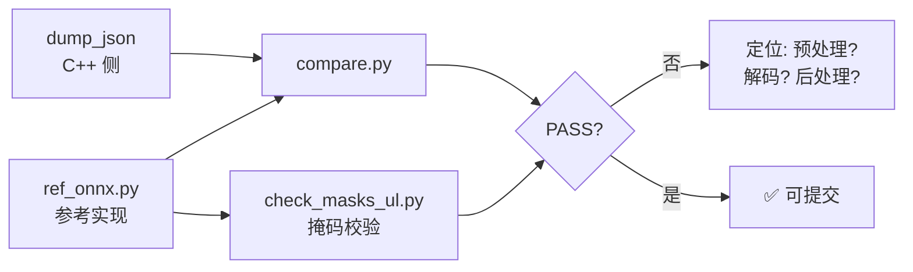

# 准确性验证工具链

本目录是框架的**精度校验工具**。精度问题应该用数字定位，而不是盯着一张标注图猜——本框架历史上定位到的多个 bug（YOLOX 二次 sigmoid、YOLOX 预处理用错、分割掩码坐标系错位、pose 二次 sigmoid）在看图时**完全不可见**，但在 IoU 数字上极其明显。

## 📑 目录

- [快速上手](#快速上手)
- [工具一览](#工具一览)
- [典型工作流](#典型工作流)
- [工具详解](#工具详解)
- [历史定位到的 bug](#历史定位到的-bug)

## 快速上手

需要 `-DWITH_TOOLS=ON` 编译出 `dump_json`：

```bash
cd build && cmake .. -DWITH_TOOLS=ON && make -j$(nproc) dump_json
```

三步比对（检测框）：

```bash
# 1. C++ 侧跑一遍，dump 成 JSON
./tools/dump_json v11 detect assets/models/yolo11n.onnx assets/images/bus.jpg out/cpp/bus.json

# 2. 参考实现（onnxruntime 显式解码 + ultralytics 官方预测）
python3 tools/ref_onnx.py --model assets/models/yolo11n.onnx --task detect \
        --image assets/images/bus.jpg --out out/ref/bus.json

# 3. 逐框比对
python3 tools/compare.py --cpp out/cpp/bus.json --ref out/ref/bus.json --iou 0.5
```

## 工具一览

| 脚本 | 作用 |
|------|------|
| [`dump_json.cpp`](#dump_json) | 跑完整管线（预处理 → 推理 → 解码 → NMS），结果 dump 成 JSON |
| [`ref_onnx.py`](#ref_onnxpy) | 参考实现：同一个 onnx 走 onnxruntime 显式解码，另附 ultralytics 官方预测 |
| [`compare.py`](#comparepy) | 类别感知的贪心 IoU 匹配；PASS = 参考框全部以 IoU ≥ 阈值命中 |
| [`check_masks_ul.py`](#check_masks_ulpy) | **掩码权威校验**：原图分辨率跑 ultralytics，直接比 C++ 掩码 IoU |
| [`yolox_pp_sweep.py`](#yolox_pp_sweeppy) | 预处理扫描（对齐方式 × 通道序 × 归一化），排查"检出率偏低" |
| [`report.py`](#reportpy) | 批量生成可视化报告（图片 + 指标汇总） |

## 典型工作流



排查"检出率偏低"时的分支：

- **框完全对不上** → 先怀疑预处理（`yolox_pp_sweep.py`），再怀疑解码
- **框数量对但位置偏移** → 怀疑 letterbox 坐标还原
- **框对了但掩码糊** → 用 `check_masks_ul.py` 单独验掩码（别用 `compare.py` 的掩码数字，它依赖自己的参考解码）

## 工具详解

### dump_json

把 C++ 推理结果导出为 JSON，供后续比对。

```bash
./tools/dump_json <model_type> <task> <model.onnx> <image> <out.json> [options]
```

| 参数 | 取值 |
|------|------|
| `model_type` | `v5` / `yolox` / `v8` / `v11` / `v26` / `ppyoloe` |
| `task` | `detect` / `segment` / `pose` / `obb` |
| `--size=WxH` | 输入尺寸，**省略则用模型自身的形状**（固定 shape 导出必须省略） |
| `--score=` `--nms=` `--classes=` `--threads=` | 阈值 / 类别数 / 线程数 |
| `--nms-mode=class\|agnostic` | NMS 策略，默认 `class` |

> ⚠️ **固定 shape 的模型不要传 `--size`**。静态导出在 ONNX 层面就拒绝其它输入形状，`Model::load()` 会读取真实形状并覆盖 `Config`，传了也没用。

### ref_onnx.py

参考实现。同时给出两份结果，便于交叉验证：

1. **onnxruntime 显式解码** —— 完全按模型格式显式写解码逻辑，不依赖任何框架的启发式
2. **ultralytics 官方预测** —— 作为第三方基准

```bash
python3 tools/ref_onnx.py --model <model.onnx> --task detect|segment \
        --image  --out <ref.json> \
        [--size=640|WxH] [--conf=0.25] [--iou=0.45] [--threads=4] [--no-ul]
```

`--no-ul` 可跳过 ultralytics 路径（环境没装 ultralytics 时使用）。

> ⚠️ **ultralytics 不能用来校验 `yolox_s.onnx`**：它不带能标识任务的 metadata，ultralytics 会误判输出布局，返回的东西没有参考价值（decoder-included 导出返回 0 个框；旧导出返回乱七八糟的类别 / `conf > 1`）。此时以 `ref_onnx.py` 的显式解码为准，并**换一个模型族**（如 yolo26s）交叉验证框。

### compare.py

类别感知的贪心 IoU 匹配，**按 score + IoU 匹配，不是按下标硬比**，所以顺序变化或多一个低分框不会读成"全错"。

```bash
python3 tools/compare.py --cpp <cpp.json> --ref <ref.json> [--iou=0.5] [-v]
python3 tools/compare.py --glob 'out/cpp/*.json'      # 按文件名与 out/ref/ 配对
```

`PASS` 的定义：参考侧每个框都被 C++ 侧以 IoU ≥ `--iou` 命中（类别需一致）。

### check_masks_ul.py

**掩码校验的权威工具。** 以原图分辨率跑 ultralytics（`retina_masks=True`），让两侧掩码处于同一坐标系，避免任何坐标猜测。

```bash
python3 tools/check_masks_ul.py --model <seg.onnx> --image  \
        --cpp <cpp.json> [--imgsz=640] [--conf=0.25] [--iou=0.45]
```

> 优先用这个。`compare.py` 里的掩码数字取决于它自己的参考解码，不是独立基准。

### yolox_pp_sweep.py

排查"模型检出率明显偏低"的工具：扫描 **对齐方式 × 通道序 × 归一化** 组合，用一个已知表现良好的检测器（如 yolo26s）作为基准打分。

```bash
python3 tools/yolox_pp_sweep.py [--model=assets/models/yolox_s.onnx] \
        [--image=assets/images/bus.jpg] [--ground-truth=out/cpp/yolo26s__bus__640.json] [--conf=0.25]
```

典型案例：YOLOX 官方预处理是 **top-left 对齐 + 保留 0-255 原值 + 无 mean/std 归一化**，与本框架其它模型的默认预处理都不同。用错默认值会让 bus.jpg 的检出从 5/5 掉到 2/5。

### report.py

批量生成可视化报告。

```bash
python3 tools/report.py [--cpp-dir=output/cpp] [--ref-dir=output/ref] \
        [--images=assets/images] [--out=output]
```

## 历史定位到的 bug

以下 bug 都在标注图上"看起来没问题"，是靠这套工具链的 IoU 数字抓出来的：

| Bug | 症状 | 根因 |
|-----|------|------|
| YOLOX 二次 sigmoid | 5445 个框，0 匹配 | 导出已含 `sigmoid(head)`，decoder 又套了一次，所有背景格挤到 ≈0.5 |
| YOLOX 预处理用错 | bus.jpg 检出 2/5 | 官方是 top-left 对齐 + 保留 0-255 + 无归一化 |
| 分割掩码坐标错位 | mask IoU 0.24 | 裁剪窗口对已还原到原图坐标的框又减了一次 letterbox padding |
| pose 二次 sigmoid | 3955 个 `score=0.5` 退化框 | `decode_pose` 无条件套 sigmoid，未复用 detect/segment 的"是否已激活"探测 |

修复后的实测：掩码 IoU vs ultralytics 从 0.24 → **0.98**（bus.jpg @640）；bus.jpg 检出 5/5（IoU 0.74–0.99）。

## 前置依赖

```bash
pip install onnxruntime numpy opencv-python ultralytics
```

- `ultralytics`：可选，`ref_onnx.py` 的基准路径与 `check_masks_ul.py` 需要它
- `compare.py` / `dump_json` 不依赖 ultralytics